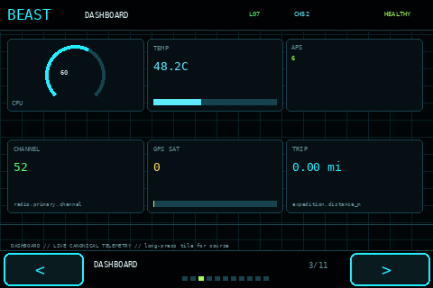

# Beastagotchi

**Beastagotchi** is a community-driven, free and open-source Raspberry Pi field-computer environment built around a protected Pwnagotchi/Bettercap engine.

The project is not intended to be a single theme or a fixed dashboard. Its long-term goal is a modular operating environment that can act as a living digital creature, real-time system/RF monitor, field terminal, app platform, configurable instrument panel, and persistent progression/exploration system while keeping the underlying Pwnagotchi service isolated and recoverable.

> **Current status:** pre-1.0 development. The current runtime baseline is **v0.18.1**. Core/data/operations architecture is substantially ahead of final UX polish; **v0.19 is the dedicated Unified Experience / UX & Visual Cohesion milestone.**



## What makes Beastagotchi different

- **Live data first.** Production views are expected to represent real, persisted or explicitly unavailable data rather than decorative fake telemetry.
- **Pwnagotchi stays protected.** Beast Core consumes/adapts Pwnagotchi, Bettercap, Linux and hardware state instead of repeatedly patching the engine.
- **The Beast remains central.** The Home/Beast experience retains creature identity, level, growth, evolution, personality, progression and rare/special events.
- **Pages/tabs/swipes remain first-class.** The curated main carousel is a high-frequency navigation layer, not an architectural limit on apps, boards, studios or future modules.
- **The TFT is the cockpit; the WebUI is the workshop.** Field interaction stays fast and readable while deep configuration/editing belongs on a responsive browser surface.
- **No silent scope loss.** Approved ideas are implemented, deferred, experimental or explicitly retired with a reason; they are not simply forgotten.
- **Local-first recovery.** Important logs, actions, backups, incidents, configuration snapshots and recovery evidence persist on the device rather than existing only in a browser.
- **Modular growth.** Themes, face packs, apps, visualizers, integrations and optional capabilities are moving toward downloadable **Beast Packs** instead of permanently bloating the base image.

## Current baseline: v0.18.1

The current validated baseline includes:

- Beast Core canonical state/event API and SQLite persistence
- Pwnagotchi Beast Bridge callbacks
- Bettercap/Wi-Fi, GPS, system, service, storage, display and hardware collectors
- 480×320 Beast UI reference renderer and touch architecture
- structural themes and native Pwnagotchi presentation profiles
- main pages plus apps, custom Boards and Spatial Studio groundwork
- Beast Studio WebUI and local action channel
- progression, achievements/awards, BeastDex, Expeditions and Rare Moment foundations
- Resource Governor and thermal/performance attribution
- plugin discovery/operations foundations
- Operations Center, Service Topology, Task Center and Black Box incidents
- backups, verification/staging, support bundles and recovery foundations
- Field Library, Universal Search and local knowledge foundations
- capability-driven external-display, Bluetooth, container and local-AI discovery
- first native-responsive Board proof at 640×480 / 800×480
- canonical personality state derived from live operational context

The attached v0.18.1 target validation returned **473/473 live state keys, 0 stale and 0 unavailable** at capture time, with the validation gallery and responsive Board proof passing. Physical TFT ownership remains a separate, reversible gate.

## Where the project is going

The immediate development milestone is **v0.19 — Unified Experience Architecture**:

- cohesive visual hierarchy and typography
- polished touch navigation and interaction patterns
- stronger Beast/Home identity
- clearer page/app/board relationships
- Presentation Broker for **Stock Pwnagotchi / Theme Manager / Beast UI** ownership handoff
- responsive multi-display architecture beyond the 480×320 reference target
- WebUI-first customization and package management
- Beast Packs / Beast Depot foundations
- Update Manager staging, compatibility checks, health observation and rollback
- phone/tablet/local companion architecture
- continued heat reduction through efficient architecture rather than normal-operation feature shedding

See [`ROADMAP.md`](ROADMAP.md) and [`docs/Beastagotchi_Master_Continuity_Ledger_v1.0.md`](docs/Beastagotchi_Master_Continuity_Ledger_v1.0.md).

## The extras are part of the product

Achievements, awards, hidden interactions, codes/ciphers, rares, legendary-style events, Rare Cinematics, seasonal/celestial moments, trophy/collection systems, evolution, Expeditions, Memory Vault/scrapbook ideas, BeastDex-style discoveries and other long-tail ideas remain explicitly tracked. They are not being removed simply because another subsystem is currently under development.

Public documentation intentionally keeps some secret content behind [`docs/SPOILERS_SECRETS_AND_ACHIEVEMENTS.md`](docs/SPOILERS_SECRETS_AND_ACHIEVEMENTS.md).

## Repository map

| Path | Purpose |
|---|---|
| `beastcore/` | privileged/local core, collectors, persistence, actions and services |
| `beastui/` | framebuffer/touch UI, pages, themes, widgets and renderers |
| `beaststudio/` | local responsive WebUI / workshop |
| `pwnagotchi_plugin/` | read-only Beast Bridge plugin |
| `config/` | shipped configuration and calibrated reference profiles |
| `systemd/`, `ui_systemd/` | service definitions |
| `display_handoff/` | reversible physical-display ownership tooling |
| `tools/` | diagnostics, render validation and maintenance tools |
| `tests/` | source/unit/regression coverage |
| `docs/` | architecture, specifications, roadmaps, validation reports and continuity ledgers |
| `.github/` | CI, issue templates and contributor workflow |

A more detailed map is in [`docs/REPOSITORY_MAP.md`](docs/REPOSITORY_MAP.md).

## Documentation start points

New readers should start here:

1. [`docs/README.md`](docs/README.md) — documentation index
2. [`docs/Beastagotchi_Design_Architecture_Bible_v1.0.md`](docs/Beastagotchi_Design_Architecture_Bible_v1.0.md) — architectural intent
3. [`docs/Beastagotchi_Master_Continuity_Ledger_v1.0.md`](docs/Beastagotchi_Master_Continuity_Ledger_v1.0.md) — anti-forgetting ledger
4. [`docs/Beastagotchi_Master_Completion_Matrix_v4.7.md`](docs/Beastagotchi_Master_Completion_Matrix_v4.7.md) — implementation status
5. [`docs/Beastagotchi_Foundation_Roadmap_v2.9.md`](docs/Beastagotchi_Foundation_Roadmap_v2.9.md) — current detailed roadmap
6. [`docs/UX_POLISH_MILESTONE_v0.19.md`](docs/UX_POLISH_MILESTONE_v0.19.md) — next UX milestone
7. [`docs/GLOSSARY.md`](docs/GLOSSARY.md) — common project vocabulary

For another developer or AI reviewer, see [`docs/COLLABORATOR_AI_HANDOFF.md`](docs/COLLABORATOR_AI_HANDOFF.md).

## Development validation

On a development machine:

```bash
python3 -m pip install -r requirements-dev.txt
PYTHONPATH=. pytest -q
python3 -m compileall -q beastcore beastui beaststudio
bash -n install.sh install_ui.sh install_bridge.sh uninstall.sh validate_v018.sh
```

Current repository validation target: **195 source tests passing**.

See [`docs/TESTING.md`](docs/TESTING.md) for the difference between source validation, off-screen Pi validation and physical hardware gates.

## Installing on a Pi

Beastagotchi is still pre-1.0 and installation is deliberately staged. Do not treat the current repository as a one-click production appliance yet.

See [`docs/INSTALLATION.md`](docs/INSTALLATION.md) before installing. The current scripts install components without automatically taking over the physical TFT.

## Collaboration with Korrie71 Theme Manager

Beastagotchi is planning explicit interoperability with [`Korrie71/pwnagotchi-theme-manager`](https://github.com/Korrie71/pwnagotchi-theme-manager). Both projects can remain installed while a Presentation Broker gives exactly one renderer/touch stack physical ownership at a time. The intended user-facing choices are approximately:

- Stock / Native Pwnagotchi
- Pwnagotchi + Theme Manager
- Beastagotchi

See [`docs/KORRIE71_THEME_MANAGER_INTEGRATION_SPEC_v0.1.md`](docs/KORRIE71_THEME_MANAGER_INTEGRATION_SPEC_v0.1.md).

## Privacy and responsible testing

Beastagotchi can process network, GPS and device telemetry. **Never post raw captures, credentials, private SSIDs/BSSIDs/client identifiers, exact GPS traces or unsanitized support bundles to public issues.** See [`SECURITY.md`](SECURITY.md).

Use Pwnagotchi/Bettercap and related radio features only on networks/devices you own or are explicitly authorized to test.

## Community and license

Beastagotchi is intended to remain a community project: learning, experimentation, contribution and growth are the goal; there is no paid feature tier or subscription roadmap.

The repository is licensed under the **GNU General Public License version 3**. See [`LICENSE`](LICENSE).

Contributions, testing reports, UI feedback, themes, hardware notes and architecture review are welcome. See [`CONTRIBUTING.md`](CONTRIBUTING.md).
